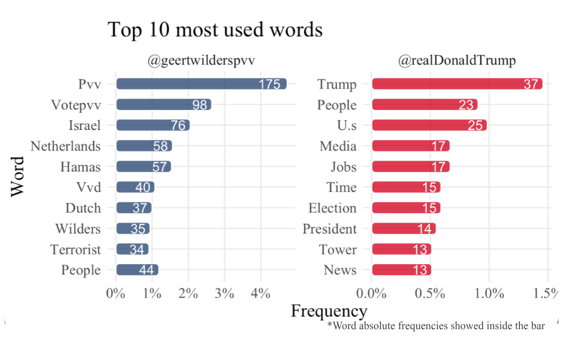

# Introduction

Geert Wilders has frequently drawn comparisons to former US President Donald Trump, not only for his distinctive hairstyles but also for their ultra-conservative ideologies (El País, 2023). The BBC went so far as to called him “the Dutch Trump” (BBC Sounds - Stories of Our Times, Meet Geert Wilders, the Dutch Trump, 2023). However, beyond these apparent similarities, what elements of their platforms appealed to voters, both in the US and The Netherlands? What are they main similarities and differences in communicating to the voters?
In 2016, Donald Trump, the Republican candidate, secured victory in the US elections with 46% of the votes (2016 Presidential Election Results, n.d.). Simultaneously, in the Netherlands, the collapse of the fourth Rutte cabinet led to early general elections. On November 22, 2023, the Party for Freedom (PVV), led by Geert Wilders, emerged as the majority party, claiming 37 out of the 150 seats in the House of Representatives (Henley et al., 2023).
Following two successful elections for conservative parties, each led by a vociferous conservative figurehead, this paper seeks to delve into the campaign rhetoric that potentially contributed to their triumphant positions. It specifically analyzes the similarities in the social media campaigns of Trump and Wilders, aiming to stimulate further research on the geopolitical shift towards a more conservative West. This shift is seems present in the increasing empowerment of far-right and populist leader ideologies among voters in both the EU and the US.
The wider implications of electoral victories for Donald Trump and Geert Wilders on the rise of conservativism in Western politics must be considered and this paper posits that analyzing campaign rhetoric could be contributing to that field. A major shift in policy landscape, not just within the U.S. and Netherlands but potentially across the West, has taken place as a result of these conservatives' rise and subsequent victory by their parties.
The growing appeal of conservative ideology, in particular its nationalist and populist impulses, is underlined by the electoral successes of Donald Trump and Geert Wilders. This trend could be showing that voters prefer leaders who take a more aggressive stance on issues such as immigration, the nation's identity and political protectionism, which suggests an important change of attitude from those traditionally conservative and moderate policy ideologies. Therefore, it is relevant to study how this rhetoric is being communicated to the voters directly from the most polarizing and controversial leaders. Understanding the factors that contributed to the success of these conservative leaders is essential as it sheds light on the wording which appeals to the voters. 
In addition, this research is designed to clarify how social media such as Twitter was used by Trump and Wilders to communicate their campaign narrative in an attempt to influencing public opinion in their respective elections. It aims to provide an insight into the mechanisms that put these conservative leaders in power through analysis of content and strategies used by Trump and Wilders on social media. The findings will contribute to a deeper understanding of the intersection between social media, political communication, and the rise of conservative ideologies.
The geopolitical effects of a conservative shift in western policy have far reaching consequences. In particular, on key issues like climate change and security, it would have a potential impact on our relationships with each other as well as trade policies and worldwide cooperation. This study seeks to explore the complex and interrelated landscape of how social media was utilized by major conservative leaders, providing an understanding of its potential implications for the future of democratic governance in the Western European region. The study seeks to inform policy makers, political analysts and the public on the underlying dynamics which have made conservative movements in the West more widespread by highlighting commonalities and differences between Donald Trump's campaign rhetoric and that of Geert Wilders.
The primary focus of this work is the analysis and comparison of the X posts on the former Twitter social network during the last two months leading up to the election for each candidate. The objective is to identify the most frequently used words, key phrases, and topics employed to communicate their respective ideologies to their audience.
The paper is structured in the following way: the literature review explores the strategic use of Twitter by populist leaders, emphasizing key themes. The theoretical framework outlines a mixed-methods research design rooted in political communication, social media studies, and populism research. The methods encompass a literature review, text mining analysis, and qualitative content analysis, detailing data collection and analysis procedures. The results section discusses Twitter's role, the manifestation of populist discourse, and distinct language strategies employed by Wilders and Trump.

# Literature Review

Gonawela et al. (2018) assert that populist leaders, exemplified by figures such as Geert Wilders and Donald Trump, strategically utilize Twitter as a platform to project themselves as fervent nationalists, embodying distinct populist characteristics within the fabric of their campaign rhetoric. A central theme that unites them is the strategic deployment of critical remarks to fabricate adversaries, thereby creating a political spectacle that resonates with their followers (Gonawela et al., 2018, p. 295). A critical framework for analysing the performative nature of general tweeting, in particular with regard to policy campaigns, is established by the concept of political spectacle. 
Political performativity refers to the deliberate presentation and dissemination of political action for public use, as is argued by philosophers such as Debord (1967) and Schechner (1988) which was established long before the existence of any social media as a platform for political leaders to reach their target audience. Individual Twitter posts have been regarded as performance acts in social media, with the collective impact of this phenomenon being a major form of political spectacle. This perspective is based on the insights of Goffman (1959) about the dramatic aspects of social interactions and highlights the theatric nature of policy communications through platforms such as Twitter. Tweets serve as scripted moments in the larger narrative of political campaigns, contributing to a compelling story that captivates the audience. When aggregated, tweets create a symbolic spectacle that shapes public opinion and political discourse, emphasizing the importance of analyzing political communication from a perspective that considers its performative and spectacular elements (Goffman, 1959; Debord, 1967; Schechner, 1988). 
"The politics of fear," as articulated by Wodak (2015), becomes a crucial tool wielded by political figures during critical junctures. This political approach involves the communication of ambiguous decisions, aligning with the mainstreaming of far-right ideologies (Boukala, 2021). In the discourse of both Wilders and Trump, a recurring focus is observed on the perceived threat posed by Muslims and Islam, framed as a security concern that places citizens above immigrants (Ott, 2016). Gonawela et al. (2018) illuminate Trump's consistent departure in the use of critical language on Twitter, distinguishing him from figures like Wilders. Nevertheless, both leaders share a pronounced inclination for various forms of antagonistic messaging, including personal insults, sarcasm, and labeling. Remarkably, these antagonistic strategies attract online recognition, evident in elevated retweet rates.
The dynamics surrounding performative demonization and identity construction in online platforms, predominantly observed in the global north, necessitate cautious consideration. This awareness is crucial not only within the specific domain of information and communication technology tools but also in a broader societal context (Yu, 2017).
Authors posit that the resonance of far-right discourse in campaigns may signify economic distress among voters, often attributed to perceived excessive immigration, influencing their national identity (Aisch et al., 2017). The argument extends to the proposition that antagonistic ideological tweeting and attacks yield tangible benefits, as indicated by increased prominence in the Twitter universe. This nuanced interplay between political rhetoric, social dynamics, and online communication platforms underscores the complex landscape of contemporary political discourse.

The shift from liberalism
Even before the Trump administration, a seismic shift in global trade dynamics had emerged, transforming established norms and ideologies. At the heart of this transformation lies a departure from the principles of a liberal trade economy, as the United States under Trump embraced a populist, anti-trade stance. This shift is not only a manifestation of Trump's populist vision for the nation, but it brought within a set of policies that marked a distancing of the US from WTO (Hopewell, 2021).
On the opposite side of the Atlantic, the European Union has transitioned its trade policy from embedded neoliberalism to what is termed "qualified openness." This signifies that “the EU aims to remain as open as possible but also needs to become as autonomous as necessary” (Schmitz & Seidl, 2022, p.835). Expanding on this discourse, Lavery (2023) introduces two distinct archetypes: 'Atlantic Europe,' aligning with the U.S. in the liberal international order, and 'Fortress Europe,' seeking autonomy through trade barriers. Additional perspectives have delved into the neoliberal shift, discussing a more interventionist approach in the EU's industrial policy and geopolitical market strategy (McNamara, 2023).
Nye (2017) argues that this liberalism crisis has led to the rise o of populism in Europe and in other parts of the world. The shift of these different perspectives from very liberal values to a more conservative or rightist perspective on economy has also caught the electorate and maybe transferred itself to a more general arena.  Far right movements are gaining spaces in governments by winning elections, with changes in popular discourse and mobilization of people (Wahlström et al., 2020).
Groshek and Koc-Michalska (2017) utilized the 2016 US election to contend that social media technologies played a significant role in garnering support for populist politicians, employing both active and passive engagement on social media platforms. In that sense, this paper focuses on what parts of the far-right discourse has attracted the voters or made them feel represented, specifically, what been the rhetoric of far-right winning candidates Geert Wilders from The Netherlands and Donald Trump on the US? This paper aims to study the similarities and differences on the X posts from the last campaign days before the election.

## Legitimation of Twitter as a political platform

Former US president Barack Obama’s first campaign whilst running for president, was seen by some scholars as a pioneering on the use of social media, using Twitter as one of its main ways to reach directly to the voters (Bode and Dalrymple, 2014). This makes sense due to the platform’s capacity for functioning as a tool of political mobilization (Strandberg, 2013). Beyond its function as a tool for political mobilization and direct communication, Twitter's real-time nature and interactivity further sets it apart as a dynamic platform. The instantaneous nature of Twitter allows for the swift dissemination of information, enabling political actors to respond quickly to unfolding events and public sentiments. This real-time responsiveness is exemplified by the fast-paced exchanges during live events, debates, and crises, providing politicians with an unparalleled avenue for connecting with their audience on a more intimate and immediate level.
Social media, in this case Twitter, offers a low-cost campaigning tool in which political agents can phrase their messaging precisely and hope to create an alternative form of reaching an audience, bypassing mainstream media channels (Gonawela et al., 2018). Notably, Twitter has experienced a substantial surge in user numbers compared to other platforms like YouTube and Facebook (Parmelee, 2014) and has become especially popular because it makes interaction from politician to voter, possible (Camacho et al. 2020). The hashtag, a hallmark feature of Twitter, serves as a potent tool for organizing conversations, building support, and nurturing collective movements around specific issues. Its viral potential enables swift and widespread dissemination of information, contributing to the democratization of political discourse. Moreover, Twitter's ability to transcend geographic barriers amplifies its influence as a global political platform. Political leaders can communicate with an international audience, transcending national boundaries to tackle global concerns and issues. This global reach not only magnifies the reach of political messages but also cultivates a sense of interconnectedness among diverse communities.
Social media has granted radical movements a crucial space on significant platforms for organizing, expanding their audience, and disseminating their message with minimal constraints and cost-effectiveness (Huntington, 2015). Beyond its role in traditional political campaigns, Twitter provides a space for transnational dialogue and collaboration on issues of global importance, such as climate change, human rights, and international relations. This ability to foster global discourse and engagement is a testament to Twitter's potential to shape and influence the political landscape on a global scale. As a result, Twitter's role as a legitimate political platform extends beyond its domestic influence, positioning it as a critical tool for promoting a more connected and informed global citizenry. Twitter's multifaceted nature, encompassing real-time engagement, global reach, and the democratization of discourse, cements its place as a crucial player in modern political communication, shaping and influencing the political landscape on a global scale. Additionally, X serves as a crucial social network for unmediated communication, enabling direct interaction with individuals (van Kessel and Castelein, 2016).

## Populism and Far-right discourse content on Twitter

On Wilders and Trump’s X posts and discourse has been a filled with rhetoric that’s proper to a populist ideology.  Populism can be defined as “an ideology that focuses on the dichotomy between the people, imagined as a homogeneous community, and the corrupt elite that deprives the people of their sovereign rights” (Mudde, 2004, p.543).  But it also uses the construction of an evil opponent or enemy who threatens this homogeneous community (Kreis, 2017). And this community tends perceive themselves as connected by their national identity and culture (Kreis, 2017). Populist movements often create an enemy or "other" that they claim poses a threat to the people they claim to represent. According to Mudde (2004, p. 544), populists view their opponents not just as people with different values and priorities, but as morally corrupt. They also capitalize on the concept of the "heartland," which refers to the cultural and national identity of the people, creating a sense of unity around a shared homeland (Taggart, 2000). Gimenez and Schwarz (2016) posit that right-wing populist parties often establish national identity through negation, defining it by identifying threats, such as immigration like in the case of the Netherlands. Additionally, populism involves a focus on a charismatic leader who champions the common people as an outsider to the establishment and operates independently of establishment patronage (Wodak, 2015).
Wahlström et al. (2020) contended that online media, especially social media, plays a pivotal role in fostering far-right violence. Their analysis of political Twitter threads revealed prevalent anti-immigrant and right-wing populist themes, with dehumanization and calls for violence associated mainly with expressions of negative emotions and themes such as crime, victimization, and a perceived failing state. Emotions like vindictiveness, disgust, and hate, couple were featured in the discussions analyzed by the authors. This type of rhetoric is rooted in the demonization of marginalized groups, leading to a toxic political climate characterized by xenophobia, intolerance, and division, which can ultimately undermine democratic values and principles.
Right-wing populist leaders and parties, such as the ones discussed in this paper, have effectively utilized social media as a strategic communication tool and a means of power politics, as highlighted by Krzyżanowski (2018). And, it has even been emphasized that right-wing populists effectively harnessed digital and social media for wider outreach, follower mobilization, and political influence (Casero-Ripollés et al., 2016). As previously mentioned, platforms like Twitter offer a low-cost tool for politicians to put out their messages and engage directly with their audience. These leaders exhibit distinct traits, including xenophobia, protectionism, nationalism, and a tendency to criticize traditional elites. Furthermore, the emergence of the Le Pen phenomenon even before Trump's 2016 victory underscores the early consolidation of populist sentiments in Europe (Curiel et al., 2021).

## Donald Trump
Donald Trump, recognized as one of the most prominent Twitter users in contemporary politics (Müller & Schwarz, 2023), has displayed exceptional activity even before his 2016 presidential candidacy. Ott (2017) notes that Trump averaged 7.5 tweets per day, totaling over 36,000 tweets annually. Despite his prolific use, Trump was simultaneously characterized as the most controversial figure on Twitter (Liu, 2017).
The 2016 U.S. electoral campaign showcased Trump's adept use of Twitter for far-right populist storytelling (Curiel & Limón-Naharro, 2019). Donald Trump's success in establishing himself as an outsider and anti-establishment figure was key to his appeal among populist supporters. Trump opposed globalization, integration, and established policies, particularly targeting supranational entities like the European Union and immigrants, refugees, and Muslim culture (Mudde, 2004; Wodak, 2015). Ott (2017) observed that Trump leveraged Twitter early on to propagate anti-Muslim rhetoric, portraying Muslims as threats requiring drastic measures. This strategic dehumanization positioned Trump as an American savior protecting the nation from perceived dangers (Khan et al., 2021). Employing a stereotype since 9/11, Trump depicted Muslims as violent fanatics ready for a holy war, aiming to implement oppressive Shariah Law (Indah & Khoirunnisa, 2022). Employing a dismantling strategy, Trump implied that building "walls" against Muslims is essential for the survival of America and Europe (Khan et al., 2021).
Kreis (2017) noted Trump's informal, direct, and provocative communication style aimed at constructing a unified people and homeland threatened by a dangerous "other." By positioning himself as a political outsider and a champion of the "forgotten people," Trump was able to capture the imagination of populists who felt that their concerns and needs were not being addressed by mainstream politicians. Trump strategically used positive self-presentation and negative portrayal of others, particularly Muslims, through demagogic language, creating an "us" vs. "them" dynamic to "Make America Great Again" (Khan et al., 2021). Analysis of President Trump's tweets reveals a simple, direct, and polarizing language, aligning with common strategies of right-wing populist discourse (Kreis, 2017).

## Gert Wilders

Far-right European populist parties, including PVV, have adopted progressive values while emphasizing national commitment. This departure from traditional conservatism, as noted by Duina and Carson (2019), involves embracing gender equality, gay rights, religious freedoms, and social services. Despite presenting themselves as defenders of Western civilization, these parties often frame their nations against perceived threats from immigrant communities, particularly Muslims (Duina & Carson, 2019).
Characterizing the conflict as a clash between civilizations, Wilders, in a 2009 speech, depicted it as a struggle between enlightenment and barbarity (Duina & Carson, 2019). The rhetoric of Wilders combines seemingly progressive values with xenophobic and extremist elements, intertwining discussions of homosexuality and women with those of religious freedom, focusing on Christianity and Judaism (Duina & Carson, 2019).	
Geert Wilders portrays himself as the sole politician genuinely addressing the concerns of Dutch society (Záhorová, 2018). Wilders in 2009 gave a speech in Los Angeles, in which he mentioned: “it is a clash between civilization and backwardness, between the civilized and the primitive, between rationality and barbarity” referring to Muslims in the Netherlands. There is also a prevailing sense of fear among Wilders' followers, often expressed through radical rhetoric. They readily amplify Wilders' messages, even without his direct participation, highlighting the influence of his communication strategies (Záhorová, 2018).

# Theoretical Framework

This study employs a mixed-methods research design, integrating both qualitative and quantitative approaches to comprehensively examine the Twitter campaigns of Geert Wilders in 2023 and Donald Trump in 2016. The research design is anchored in the theoretical framework of political communication, social media studies, and populism research. The primary objectives are to investigate the legitimization of Twitter as a political platform, analyze populist and far-right discourse content on Twitter, and compare the language strategies of Wilders and Trump.
There is also a more qualitative analysis that draws on prior research on social media's role in political campaigns, the impact of Twitter on political communication, and the utilization of social media by populist and far-right leaders. The qualitative component involves a content analysis of the textual data, focusing on identifying populist and far-right discourse elements. This includes the analysis of themes, sentiments, and the construction of an 'us' vs. 'them' narrative.
The quantitative component involves text mining, inspired by the methodology presented in the "Text Mining with R" book by Julia Silge and David Robinson. The analysis includes the collection of Twitter data using the Twitter API for Donald Trump and manual collection for Geert Wilders due to policy changes. The focus is on the last 50 days of each campaign, resulting in a dataset comprising 565 posts (303 from Wilders, 262 from Trump).

Quantitative methods:
Frequency Analysis: Word frequency analysis is conducted to identify patterns and rhetoric in the language used by Wilders and Trump. This includes a comparison of the frequency of specific words, examining potential polemic language and populist strategies.
TF-IDF Analysis: Term Frequency-Inverse Document Frequency (TF-IDF) analysis is employed to measure the importance of words on specific days. This analysis helps identify key themes and topics dominating the discourse in the final days of the campaigns.

# X (Twitter) analysis
Results and analysis can be found on GitHub along with the data bases and scripts to reproduce the results and visualizations.
The data was collected by connecting with the Twitter’s developers API, in the case of Donald Trump’s tweets. But for collecting Wilders more recent posts, since the app had already changed to X when the Dutch campaign happened, connection wasn’t possible due to policy changes, and for that reason most of Wilder’s posts were collected manually.
The data analysis focuses on last 50 days of campaign before the election day of both winning leaders, Geert Wilders in 2023 and Donald Trump in 2016. The data set consists of a total of 565 posts, 303 from Wilders and 262 from Trump.
The frequency of the words used by Wilders in his X posts show a more pronounced rhetoric of the populist strategy mentioned before, that consists in the creation of an enemy. We can see on Figure 1 that, even taught, scholars described Trump’s Twitter strategy as aggressive and polemic, Wilders shows a wider frequency of possible polemic words. Such as “Israel” and “Hamas”, when he defends Jewish people and condemns the Hamas attacks; also, when he calls Palestinians “terrorists” and arguing that hospital bombing was valid because they were hiding on them. Furthermore, we could by seeing sings of a populist rhetoric by the use high use of the word “people” on both profiles, or maybe this could just be attributed to a mainstream electoral campaign technique. Another similarity between Trump’s and Wilder’s is the repeated use of the nationality, such as “Dutch” or “U.S” to possibly denote a sense of belonging and add up to the “us” and the “others” discourse.
Figure 2 shows the relationship of frequency between two groups of text, in this case Wilder’s and Trump’s X posts. Words that are close to the line in these plots have similar frequencies in both sets of texts and words that are far from the line are words that are found more in one set of texts than another.

By analyzing Figure 2 we can corroborate what’s been showed in Figure 1, some of the more aggressive words are more prominent on Wilder’s posts than in Trump’s posts. But they use words such as “people” or “country”, “change” on a similar frequency. They also use word “house” pretty frequently, likely referring to property crisis.

Figure 2
“The statistic tf-idf is intended to measure how important a word is to a document in a collection (or corpus) of documents, for example, to one novel in a collection of novels or to one website in a collection of websites” (Silge & Robinson, n.d.). In this case we are doing it separately for both politicians in a collection of days. So, what is being presented in Figure 3 is not the frequency of a word, but how important it is on a particular day, in other words, the key words of each day.
The analysis of the keywords from the last 20 days of Geert Wilders' campaign reveals a diverse set of topics. Among the prominent themes are discussions about freedom, the Taliban, and issues related to immigration, as indicated by terms like "azc" (asylum center) and "visa." Additionally, the mention of "Israel" and "Islam" suggests a focus on geopolitical and religious aspects. The inclusion of "cats", hinting at a blend of national and perhaps cultural themes. The recurrence of certain terms, such as "rtldebate" and "youthjournaal," points to engagements with media platforms and youth-related matters. This diverse range of keywords underscores the multifaceted nature of Wilders' campaign discourse during this crucial period.

Figure 3 For the repeated key words that are plotted but not visible are in Appendix 1.
The analysis of the keywords from the final 20 days of Donald Trump's campaign offers insights into the diverse themes. References to "Lincoln Memorial" and "Ivanka" suggest a mix of historical and familial elements, potentially indicating a strategic connection to symbols of national heritage and the candidate's family image. "Optimism" appears to be a recurring theme, reflecting a positive tone in the campaign's messaging. The presence of "computer" may signal discussions on technology or cybersecurity, while "plan" and "coverage" suggest a focus on strategic planning and media engagement. Overall, these keywords indicate a blend of historical, familial, strategic, and optimistic aspects in the final stretch of Donald Trump's 2016 campaign.

#Results
The analysis reveals several key findings that shed light on the role of Twitter in political campaigns, the populist and far-right discourse content employed by leaders such as Geert Wilders and Donald Trump, and the distinctive patterns in their language use. 
The results affirm Twitter's legitimacy as a significant political platform, emphasizing its role as a low-cost tool for political mobilization and engagement with the electorate. The surge in Twitter's user numbers compared to other platforms underscores its popularity for unmediated communication between politicians and voters. The findings align with existing literature highlighting the transformative impact of Twitter on political communication, turning it into a central theoretical trend (Campos-Domínguez, 2017; Hendricks and Kaid, 2014).
Both Geert Wilders and Donald Trump exhibit rhetoric consistent with populist ideologies. The discourse emphasizes the dichotomy between a homogeneous community (the people) and a corrupt elite, constructing an enemy to the community. This aligns with the definition of populism as an ideology focused on this dichotomy (Mudde, 2004). The strategic use of Twitter allows these leaders to foster a sense of national identity through negation, often centering on immigration as a threat (Duina & Carson, 2019). The findings are in line with the broader literature highlighting the effective use of social media by right-wing populist leaders for wider outreach and political influence (Casero-Ripollés et al., 2016; Nilsson and Carlsson, 2014).
The language analysis reveals nuances in the language strategies employed by Geert Wilders and Donald Trump. Wilders, particularly in the last 50 days of his campaign, exhibits a more pronounced use of aggressive and polemic words, possibly contributing to a heightened sense of populism. Trump's language, although prolific and controversial, shows a different frequency pattern, possibly reflecting a unique style of communication. The thematic analysis of keyword frequencies provides insights into the diverse topics and strategic emphases of the two campaigns, with Wilders touching on geopolitical and religious aspects, and Trump engaging with historical, familial, and optimistic themes.
Despite the valuable insights, this study has limitations. The manual collection of Wilders' tweets introduces potential biases, and the focus on the last 50 days of the campaign may not capture the entire narrative. Additionally, the analysis primarily focuses on linguistic patterns, and a more comprehensive study could delve into the visual and multimedia aspects of the tweets.

# Conclusion
The findings reinforce the significance of Twitter as a vital tool in contemporary political communication, not just for its affordability but also its ability to directly reach and engage voters. This is also contextual as the growing user base of Twitter in comparison to other social media platforms further underscored its popularity, facilitating unfettered communication between political leaders and the public. But since its change in ownership and rebranding from Twitter to X – its effectiveness might have been altered which is not in the scope of this research. But as it stands, this observation aligns with previous research highlighting the transformative impact of Twitter on political discourse, consolidating its position as a crucial aspect in the field (Campos-Domínguez, 2017; Hendricks and Kaid, 2014). The data analysis scrutinizes the final few days of the campaigns of Geert Wilders in 2023 and Donald Trump in 2016, encompassing a total of 565 posts (303 from Wilders and 262 from Trump) operating under the logic that right before the elections the leaders strategically escalated content that was more popular among their respective demographics. Wilders employs a populist strategy, notably characterized by a more aggressive use of polemic words, especially making controversial and polarizing comments on current ethno-conflicts. It is intriguing to consider the cultural context in interpreting this stark rhetoric. The Dutch are renowned for their directness, and this attribute may play a role in Wilders getting away with expressing more overtly aggressive stances than Trump did in the U.S. In the context of American politics, where certain statements are considered outrageous, Wilders' posts can be seen as even more radical, suggesting a form of extremist populist rhetoric. This may indicate a higher tolerance within Dutch political discourse for such assertive positions or perhaps a gap that Wilders is strategically filling, addressing issues that other politicians may be avoiding.
This study aims to contribute to the evolving literature on political communication,
particularly on Twitter, unraveling distinct strategies employed by right-wing populist leaders Geert Wilders and Donald Trump. The findings affirm Twitter's role in facilitating unmediated communication between politicians and the electorate, particularly in the context of a global shift toward conservative ideologies. The research underscores the manifestation of populist ideologies, characterized by the construction of a dichotomy between the 'people' and a perceived corrupt elite, aligning with prior definitions of populism. Wilders and Trump exhibited unique language strategies, with Wilders employing aggressive and polemic rhetoric, contributing to heightened populism, while Trump showcased a distinctive communication style. Thematic analyses of keyword frequencies highlighted diverse topics and strategic emphases, emphasizing the need for future research to explore additional dimensions of social media communication. In conclusion, this research sheds light on the intricate dynamics between Twitter, political discourse, and populist ideologies, urging further exploration to comprehend the evolving implications for contemporary politics.

# References
2016 presidential election results. (n.d.). https://www.nytimes.com/elections/2016/results/president
Aisch, G., Pearce, A., & Rousseau, B. (2017, November 9). How far is Europe swinging to the right? The New York Times. https://nyti.ms/2jS1pHx
BBC Sounds - Stories of our times, Meet Geert Wilders, the Dutch Trump. (2023, December 7). BBC. https://www.bbc.co.uk/programmes/p0gy09ph
Bode, L., & Dalrymple, K. E. (2014). Politics in 140 characters or less: campaign communication, network interaction, and political participation on Twitter. Journal of Political Marketing, 15(4), 311–332. https://doi.org/10.1080/15377857.2014.959686
Boukala, S. (2021). Far-right discourse as legitimacy? Analysing political rhetoric on the “migration issue” in Greece. Studies in Communication Sciences, 1–13. https://doi.org/10.24434/j.scoms.2021.02.014
Camacho, D., Panizo-LLedot, Á., Bello-Orgaz, G., González-Pardo, A., & Wang, Z. (2020). The four dimensions of social network analysis: An overview of research methods, applications, and software tools. Information Fusion, 63, 88–120. https://doi.org/10.1016/j.inffus.2020.05.009
Casero-Ripollés, A., Feenstra, R. A., & Tormey, S. (2016). Old and New Media Logics in an Electoral Campaign. The International Journal of Press/Politics, 21(3), 378–397. https://doi.org/10.1177/1940161216645340
Curiel, C. P., & Limón-Naharro, P. (2019). Political Influencers. A Study of Donald Trump’s personal brand on Twitter and its impact on the media and online readers. Comunicacion Y Sociedad, 32(1). https://doi.org/10.15581/003.32.1.57-76
Curiel, C. P., Rivas-De-Roca, R., & García-Gordillo, M. (2021). Impact of Trump’s Digital Rhetoric on the US Elections: A View from Worldwide Far-Right Populism. Social Sciences, 10(5), 152. https://doi.org/10.3390/socsci10050152
Debord, G. (1995). The Society of the Spectacle (D. Nicholson-Smith, Trans.). Zone Books. https://doi.org/10.2307/j.ctv1453m69
Duina, F., & Carson, D. (2019). Not so right after all? Making sense of the progressive rhetoric of Europe’s far-right parties. International Sociology, 35(1), 3–21. https://doi.org/10.1177/0268580919881862
Gimenez, E., & Schwarz, N. (2016). The visual construction of “the people” and “proximity to the people” on the online platforms of the National Front and Swiss People’s Party. Österreichische Zeitschrift Für Soziologie, 41(2), 213–242. https://doi.org/10.1007/s11614-016-0200-3
Goffman, E. (1959). The presentation of self in everyday life. Bantam Doubleday Dell Publishing Group. 
Gonawela, A., Pal, J., Thawani, U., Van Der Vlugt, E., Out, W., & Chandra, P. (2018). Speaking their Mind: Populist Style and Antagonistic Messaging in the Tweets of Donald Trump, Narendra Modi, Nigel Farage, and Geert Wilders. Computer Supported Cooperative Work, 27(3–6), 293–326. https://doi.org/10.1007/s10606-018-9316-2
Groshek, J., & Koc-Michalska, K. (2017). Helping populism win? Social media use, filter bubbles, and support for populist presidential candidates in the 2016 US election campaign. Information, Communication & Society, 20(9), 1389–1407. https://doi.org/10.1080/1369118x.2017.1329334
Henley, J., Sauer, P., & Boztas, S. (2023, November 24). Far-right party set to win most seats in Dutch elections, exit polls show. The Guardian. https://www.theguardian.com/world/2023/nov/22/far-right-party-set-to-win-most-seats-in-dutch-elections-exit-polls-show
Hopewell, K. (2021). Trump &amp; Trade: The Crisis in the Multilateral Trading System. Social Science Research Network. https://doi.org/10.2139/ssrn.3758587
Huntington, H. (2015). Pepper Spray Cop and the American Dream: Using synecdoche and metaphor to unlock internet memes’ visual political rhetoric. Communication Studies, 67(1), 77–93. https://doi.org/10.1080/10510974.2015.1087414
Indah, R. N., & Khoirunnisa, A. (2022). Argumentative Statements in the 2016 presidential debates of the U.S: A Critical Discourse analysis. JEELLS (Journal of English Education and Linguistics Studies), 4(2), 155–173. https://doi.org/10.30762/jeels.v4i2.347
Khan, M. H., Qazalbash, F., Adnan, H. M., Yaqin, L. N., & Khuhro, R. A. (2021). Trump and Muslims: A Critical Discourse Analysis of Islamophobic rhetoric in Donald Trump’s selected tweets. SAGE Open, 11(1), 215824402110041. https://doi.org/10.1177/21582440211004172
Kreis, R. (2017). The “Tweet politics” of President Trump. Journal of Language and Politics, 16(4), 607–618. https://doi.org/10.1075/jlp.17032.kre
Krzyżanowski, M. (2017). Discursive Shifts in Ethno-Nationalist Politics: on politicization and mediatization of the “Refugee crisis” in Poland. Journal of Immigrant & Refugee Studies, 16(1–2), 76–96. https://doi.org/10.1080/15562948.2017.1317897
Lavery, S. (2023). Rebuilding the fortress? Europe in a changing world economy. Review of International Political Economy, 1–24. https://doi.org/10.1080/09692290.2023.2211281
Liu, C. (2017). Reviewing the Rhetoric of Donald Trump's Twitter of the 2016 Presidential Election. DIVA. https://www.diva-portal.org/smash/record.jsf?dswid=9669&pid=diva2%3A1117157
McNamara, K. R. (2023). Transforming Europe? The EU’s industrial policy and geopolitical turn. Journal of European Public Policy, 1–26. https://doi.org/10.1080/13501763.2023.2230247
Mudde, C. (2004). The populist Zeitgeist. Government and Opposition, 39(4), 541–563. https://doi.org/10.1111/j.1477-7053.2004.00135.x
Müller, K., & Schwarz, C. (2023). From hashtag to hate crime: Twitter and antiminority sentiment. American Economic Journal: Applied Economics, 15(3), 270–312. https://doi.org/10.1257/app.20210211
Nye, J. S. (2017). Will the liberal order survive? The History of an Idea. Foreign Affairs, 96, 1. https://www.jstor.org/stable/44823225
Ott, B. L. (2016). The age of Twitter: Donald J. Trump and the politics of debasement. Critical Studies in Media Communication, 34(1), 59–68. https://doi.org/10.1080/15295036.2016.1266686
País, E. E. (2023, November 28). Geert Wilders in EL PAÍS English. EL PAÍS English. https://english.elpais.com/news/geert-wilders/
Parmelee, J. H. (2013). The agenda-building function of political tweets. New Media & Society, 16(3), 434–450. https://doi.org/10.1177/1461444813487955
Schechner, R. (1988). Performance Theory. Routledge. https://doi.org/10.4324/9780203361887
Schmitz, L., & Seidl, T. (2022). As open as possible, as autonomous as necessary: Understanding the rise of open strategic autonomy in EU trade policy. JCMS: Journal of Common Market Studies, 61(3), 834–852. https://doi.org/10.1111/jcms.13428
Silge, J., & Robinson, D. (n.d.). Welcome to Text Mining with R | Text Mining with R. https://www.tidytextmining.com/
Strandberg, K. (2013). A social media revolution or just a case of history repeating itself? The use of social media in the 2011 Finnish parliamentary elections. New Media & Society, 15(8), 1329–1347. https://doi.org/10.1177/1461444812470612
Taggart, P. (2000). Populism. Buckingham: Open University Press. 
Torregrosa, J., Panizo-LLedot, Á., Bello-Orgaz, G., & Camacho, D. (2020). Analyzing the relationship between relevance and extremist discourse in an alt-right network on Twitter. Social Network Analysis and Mining, 10(1). https://doi.org/10.1007/s13278-020-00676-1
Van Kessel, S., & Castelein, R. (2016). Shifting the blame. Populist politicians’ use of Twitter as a tool of opposition. Journal of Contemporary European Research, 12(2). https://doi.org/10.30950/jcer.v12i2.709
Wahlström, M., Törnberg, A., & Ekbrand, H. (2020). Dynamics of violent and dehumanizing rhetoric in far-right social media. New Media & Society, 23(11), 3290–3311. https://doi.org/10.1177/1461444820952795
Wodak, R. (2015). The Politics of Fear: What Right-Wing populist discourses Mean. https://doi.org/10.4135/9781446270073
Yu, B. (2017). An investigation of design parameters for constructive online discussion environment. European Conference on Computer Supported Cooperative Work. https://doi.org/10.18420/ecscw2017_dc9
Záhorová, K. (2018). Propaganda on social media: The case of Geert Wilders. https://dspace.cuni.cz/handle/20.500.11956/99767?locale-attribute=cs

## Data Collection

Trump’s tweets were collected through the Twitter API. Due to changes in X’s data access policies, Wilders’ posts were collected manually.